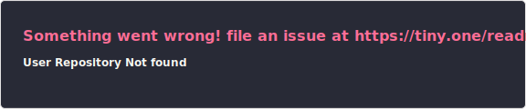

# Brandon M. Greenwell 🚀

### Director of Data Science @ 84.51° | Adjunct Instructor @ University of Cincinnati | Ph.D. in Applied Math

📧 [Email](mailto:greenwell.brandon@gmail.com) | 🎓 [Google Scholar](https://scholar.google.com/citations?user=YUHzBUEAAAAJ&hl=en) | 💼 [LinkedIn](https://www.linkedin.com/in/brandon-greenwell/)

---

Hi there! I'm Brandon, a statistician turned machine learning practitioner and tools developer. I bridge the gap between theoretical statistical foundations and scalable, production-grade AI. Currently leading AI Enablement at 84.51° (Kroger's data science arm) and teaching graduate-level stats and analytics.

When I'm not training models or teaching, I'm building high-performance developer tooling in **Rust** and **Go**, or writing and maintaining statistical packages in **R**.

---

### ⚡ Highlights

- **🏢 Work**: Designing enterprise-grade foundational AI/ML tooling, libraries, and patterns for the Kroger ecosystem.
- **📚 Books & Writing**: Author of *Hands-On Machine Learning with R* and *Tree-Based Methods for Statistical Learning in R*.
- **🛠️ Open Source**: Active maintainer and contributor to highly-cited R packages (e.g., `fastshap`, `pdp`, `vip`) and modern CLI/terminal utilities in Rust and Go.

---

## 💻 Featured Open Source Projects

### 🦀 Rust Projects

### 🐹 Go Projects

### 📊 R Packages (CRAN Published)

---

## 🏢 Experience & Roles

**Director of Data Science @ 84.51°**
- Tech lead on the AI Enablement team, building foundational ML tooling and reusable patterns across the Kroger enterprise.

---

## 🏫 Teaching

**Adjunct Instructor @ University of Cincinnati** (2022 - Present)
- Department of OBAIS — teaching graduate-level statistical modeling, business analytics, and programming with AI courses.

**Adjunct Instructor @ Wright State University** (2017 - 2022)
- Taught graduate-level Biostatistics and Environmental Statistics courses.

---

## 🎓 Education

- **Ph.D. in Applied Mathematics** — Air Force Institute of Technology (2014)
  - Dissertation: [*Topics in Statistical Calibration*](https://apps.dtic.mil/sti/pdfs/ADA598921.pdf) | GPA: 4.0
- **M.S. in Applied Statistics** — Wright State University (2011) | GPA: 4.0
- **B.S. in Statistics** — Wright State University (2009)
- **Accredited Graduate Statistician (GStat)** — American Statistical Association (2014)

---

## 📈 GitHub Stats & Languages

  
  

---

## 🤝 Connect With Me

- 💼 [LinkedIn](https://www.linkedin.com/in/brandon-greenwell/)
- 🎓 [Google Scholar](https://scholar.google.com/citations?user=YUHzBUEAAAAJ&hl=en)
- 📧 Email: [greenwell.brandon@gmail.com](mailto:greenwell.brandon@gmail.com)
