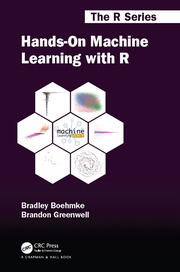
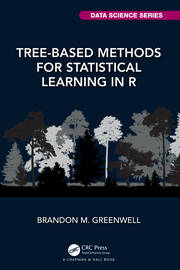
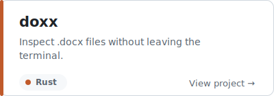
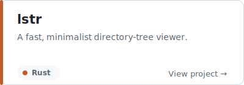
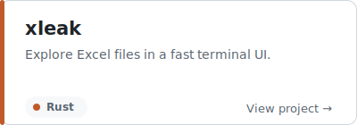
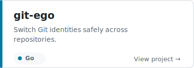
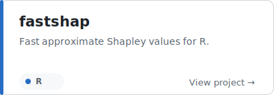
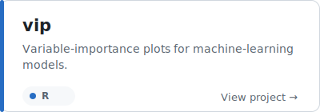
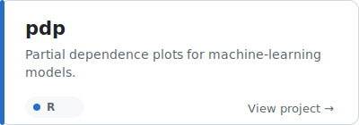
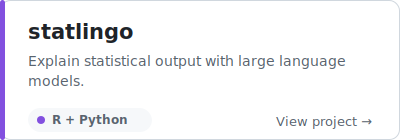

# Brandon M. Greenwell, PhD

### Director of Data Science @ 84.51° · Adjunct @ UC

Statistician by training, ML practitioner and tools developer by trade. I build practical software at the intersection of statistical rigor, responsible AI, and developer experience, and teach graduate-level statistics, analytics, and AI-assisted programming.

[Google Scholar](https://scholar.google.com/citations?user=YUHzBUEAAAAJ&hl=en) · [LinkedIn](https://www.linkedin.com/in/brandon-greenwell/) · [CV](https://bgreenwell.github.io)

---

## Books

<table>
  <tr>
    <td width="50%" align="center" valign="top">
       
      <a href="https://www.routledge.com/Hands-On-Machine-Learning-with-R/Boehmke-Greenwell/p/book/9781138495685"><strong>Hands-On Machine Learning with R</strong></a> 
      Co-authored with Brad Boehmke · 2019  
      A practical, end-to-end guide to building, evaluating, and interpreting machine-learning models in R.  
      <a href="https://www.routledge.com/Hands-On-Machine-Learning-with-R/Boehmke-Greenwell/p/book/9781138495685">Publisher</a> · <a href="https://koalaverse.github.io/homlr/">Companion site</a>
    </td>
    <td width="50%" align="center" valign="top">
       
      <a href="https://www.routledge.com/Tree-Based-Methods-for-Statistical-Learning-in-R/Greenwell/p/book/9780367532468"><strong>Tree-Based Methods for Statistical Learning in R</strong></a> 
      Author · 2022  
      A ground-up treatment of decision trees, random forests, and boosting, with code-based examples in R.  
      <a href="https://www.routledge.com/Tree-Based-Methods-for-Statistical-Learning-in-R/Greenwell/p/book/9780367532468">Publisher</a> · <a href="https://bgreenwell.github.io/treebook/">Companion site</a>
    </td>
  </tr>
</table>

---

## Featured open-source projects

<table>
  <tr>
    <td width="50%">
      <a href="https://github.com/bgreenwell/doxx">
        <picture>
          <source media="(prefers-color-scheme: dark)" srcset="./profile/cards/doxx-dark.svg">
          <source media="(prefers-color-scheme: light)" srcset="./profile/cards/doxx-light.svg">
          
        </picture>
      </a> 
      
    </td>
    <td width="50%">
      <a href="https://github.com/bgreenwell/lstr">
        <picture>
          <source media="(prefers-color-scheme: dark)" srcset="./profile/cards/lstr-dark.svg">
          <source media="(prefers-color-scheme: light)" srcset="./profile/cards/lstr-light.svg">
          
        </picture>
      </a> 
      
    </td>
  </tr>
  <tr>
    <td width="50%">
      <a href="https://github.com/bgreenwell/xleak">
        <picture>
          <source media="(prefers-color-scheme: dark)" srcset="./profile/cards/xleak-dark.svg">
          <source media="(prefers-color-scheme: light)" srcset="./profile/cards/xleak-light.svg">
          
        </picture>
      </a> 
      
    </td>
    <td width="50%">
      <a href="https://github.com/bgreenwell/git-ego">
        <picture>
          <source media="(prefers-color-scheme: dark)" srcset="./profile/cards/git-ego-dark.svg">
          <source media="(prefers-color-scheme: light)" srcset="./profile/cards/git-ego-light.svg">
          
        </picture>
      </a> 
      
    </td>
  </tr>
  <tr>
    <td width="50%">
      <a href="https://github.com/bgreenwell/fastshap">
        <picture>
          <source media="(prefers-color-scheme: dark)" srcset="./profile/cards/fastshap-dark.svg">
          <source media="(prefers-color-scheme: light)" srcset="./profile/cards/fastshap-light.svg">
          
        </picture>
      </a> 
      
    </td>
    <td width="50%">
      <a href="https://github.com/bgreenwell/vip">
        <picture>
          <source media="(prefers-color-scheme: dark)" srcset="./profile/cards/vip-dark.svg">
          <source media="(prefers-color-scheme: light)" srcset="./profile/cards/vip-light.svg">
          
        </picture>
      </a> 
      
    </td>
  </tr>
  <tr>
    <td width="50%">
      <a href="https://github.com/bgreenwell/pdp">
        <picture>
          <source media="(prefers-color-scheme: dark)" srcset="./profile/cards/pdp-dark.svg">
          <source media="(prefers-color-scheme: light)" srcset="./profile/cards/pdp-light.svg">
          
        </picture>
      </a> 
      
    </td>
    <td width="50%">
      <a href="https://github.com/bgreenwell/statlingo">
        <picture>
          <source media="(prefers-color-scheme: dark)" srcset="./profile/cards/statlingo-dark.svg">
          <source media="(prefers-color-scheme: light)" srcset="./profile/cards/statlingo-light.svg">
          
        </picture>
      </a> 
      
    </td>
  </tr>
</table>

**More developer tools:** [`jotdown-rs`](https://github.com/bgreenwell/jotdown-rs) — private-by-default, git-friendly command-line notes.

**More statistical and ML software:** [`sure`](https://github.com/bgreenwell/sure) · [`investr`](https://github.com/bgreenwell/investr) · [`ebm`](https://github.com/bgreenwell/ebm)

---

**Education:** Ph.D., Applied Mathematics — Air Force Institute of Technology · M.S., Applied Statistics — Wright State University · B.S., Statistics — Wright State University · [dissertation](https://apps.dtic.mil/sti/pdfs/ADA598921.pdf)
