# Brandon M. Greenwell, PhD

### Director of Data Science @ 84.51° · Adjunct @ UC

Statistician by training, ML practitioner and tools developer by trade. I'm the science tech lead for the Responsible AI team at 84.51° (Kroger's data science arm) and teach graduate-level statistics, analytics, and AI-assisted programming at UC.

Most of what I build lives at the intersection of statistical rigor and practical ML — R packages for model interpretation ([`fastshap`](https://github.com/bgreenwell/fastshap), [`pdp`](https://github.com/bgreenwell/pdp), [`vip`](https://github.com/koalaverse/vip)), two books on machine learning with R ([*Hands-On Machine Learning with R*](https://www.routledge.com/Hands-On-Machine-Learning-with-R/Boehmke-Greenwell/p/book/9781138495685) and [*Tree-Based Methods for Statistical Learning in R*](https://www.routledge.com/Tree-Based-Methods-for-Statistical-Learning-in-R/Greenwell/p/book/9780367532468)), and increasingly, developer tooling in **Rust** and **Go**.

[Google Scholar](https://scholar.google.com/citations?user=YUHzBUEAAAAJ&hl=en) · [LinkedIn](https://www.linkedin.com/in/brandon-greenwell/) · [CV](https://bgreenwell.github.io)

---

## Featured open-source projects

### Rust projects
<table>
  <tr>
    <td></td>
    <td></td>
  </tr>
  <tr>
    <td></td>
    <td></td>
  </tr>
</table>

### Go projects

### R packages (CRAN published)
<table>
  <tr>
    <td></td>
    <td></td>
  </tr>
  <tr>
    <td></td>
    <td></td>
  </tr>
  <tr>
    <td></td>
    <td></td>
  </tr>
  <tr>
    <td></td>
    <td></td>
  </tr>
</table>

---

## Education

- **Ph.D. in Applied Mathematics** — Air Force Institute of Technology (2014) · [dissertation](https://apps.dtic.mil/sti/pdfs/ADA598921.pdf)
- **M.S. in Applied Statistics** — Wright State University (2011)
- **B.S. in Statistics** — Wright State University (2009)

---

